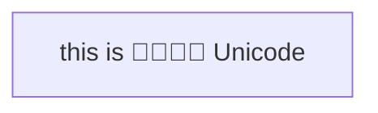
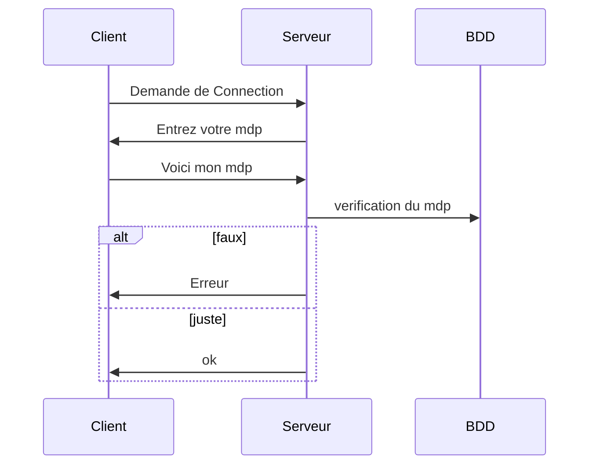
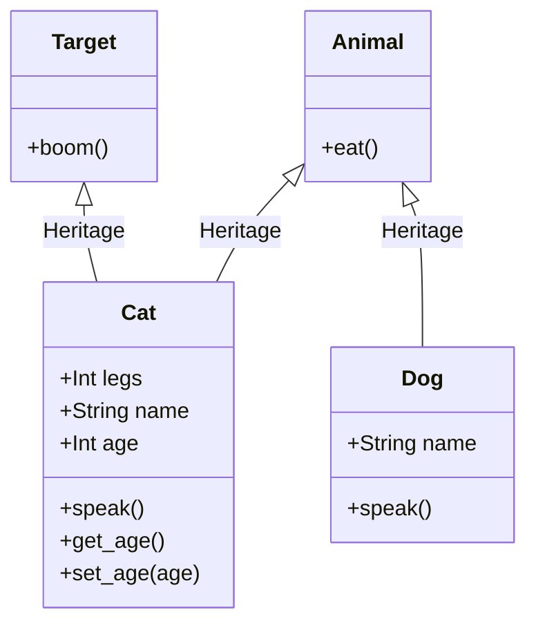

# Mermaidjs

```mermaid
flowchart LR
    id["this is 👌🏻✌🏻 Unicode"]
```

```mermaid
sequenceDiagram
    Client->>Serveur: Demande de Connection
    Serveur->>Client: Entrez votre mdp

    Client->>Serveur: Voici mon mdp
    Serveur->>BDD: verification du mdp

    alt faux
        Serveur->>Client: Erreur
    else juste
        Serveur->>Client: ok
    end
```

```mermaid
classDiagram
    class Cat{
        +Int legs
        +String name
        +Int age
        +speak()
        +get_age()
        +set_age(age)
    }

    class Dog{
        +String name
        +speak()
    }

    class Target{
        +boom()
    }

    class Animal{
        +eat()
    }
    Target <|-- Cat : Heritage
    Animal <|-- Cat : Heritage
    Animal <|-- Dog : Heritage

```

```puml
@staruml
User ->(Start)
User ->(Use)
:Main Admin: as Admin
Admin -> (Use)
enduml
```
